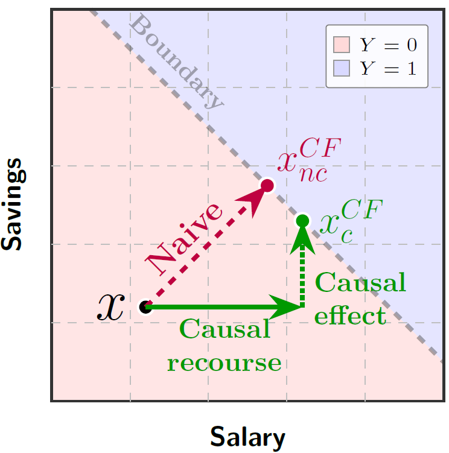

# Causal Optimal Transport Experiments



Optimal Transport for **causal** recourse analysis: three experiments (C1-C3) that
study how the true latent/causal transport differs from a naive ambient transport.

## Experiments

| ID | Module | What it measures |
|----|--------|------------------|
| C1 | `c1_causality` | Stability of OT under anisotropic deformations `X = M U`, `M = I + cN`. Tracks conjugacy error `‖T_X − M∘T_U∘M⁻¹‖` and its power-law scaling in the anisotropy ratio `κ = Λ/λ` (2D and 5D) |
| C2 | `c2_comparison` | Comparison against a series of baselines for a collection of benchmark datasets |
| C3 | `c3_robustness` | Robustness of causal recourse methods unders noise in the underlying structural equations |

## Project structure

```
causal/
├── fairopt/                  # the package (self-contained)
│   ├── core/                 # Sinkhorn solver, cost, metrics
│   ├── data/                 # dataset loaders + preprocessing
│   ├── utils/                # ILR transform
│   └── experiments/          # c1_causality, c2_comparison,
│                             # c3_robustness, config, runner, run_all
├── tests/                    # pytest suite (sinkhorn, ilr)
├── visualization.ipynb       # C1, C2, C3 plots + LaTeX tables
├── pyproject.toml            # dependencies
├── Dockerfile                # reproducible container
└── Makefile                  # convenience targets
```

## Installation

Requires Python >= 3.10.

```bash
python -m venv .venv
source .venv/bin/activate        # Windows: .venv\Scripts\activate
pip install -e ".[viz]"          # -e . for experiments only
```

The `viz` extra adds Jupyter, matplotlib and seaborn for `visualization.ipynb`.

## Running the experiments

Each experiment writes CSVs into `results/` (created automatically).

```bash
# single experiments
python -m fairopt.experiments.c1_causality
python -m fairopt.experiments.c2_comparison
python -m fairopt.experiments.c3_robustness

# everything sequentially
python -m fairopt.experiments.run_all
```

## Visualization

```bash
jupyter notebook visualization.ipynb
```

The notebook loads the CSVs from `results/` and renders the figures/tables for
C1, C2 and C3. Run the experiments first (or the `--help` of `run_all`).

## Docker (reproducible environment)

```bash
make docker-build          # docker build -t fairopt-causal .
make docker-run            # runs all experiments, results written to ./results
```

or manually:

```bash
docker build -t fairopt-causal .
docker run --rm -v "$(pwd)/results:/app/results" fairopt-causal
```

Override the default command to run a single experiment or the notebook server:

```bash
docker run --rm -v "$(pwd)/results:/app/results" fairopt-causal python -m fairopt.experiments.c1_causality
docker run --rm -p 8888:8888 -v "$(pwd)/results:/app/results" fairopt-causal jupyter notebook --ip=0.0.0.0 --allow-root
```

## Reproducibility notes

- **Network access is required on first run**: OpenML datasets (adult, LSAC,
  credit_default, student, german), the COMPAS CSV from GitHub, and the ecoli70
  network (`https://www.bnlearn.com/bnrepository/ecoli70/ecoli70.rda`, parsed with
  `rdata`). Nothing is vendored; the same URLs are pinned in the loaders.
- Randomness is seeded (`torch` seed 42, `np.random.RandomState(42)`) inside each
  experiment; C2/C3 additionally use sklearn's `KFold(random_state=42)`.
- Results are deterministic for a fixed seed set, but exact numeric output can
  differ slightly across platforms due to BLAS/threading.

## Testing

```bash
pip install -e ".[dev]"
python -m pytest tests/ -v --tb=short
```
